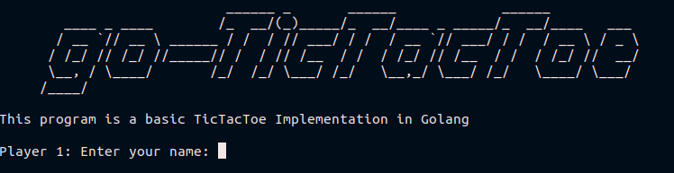
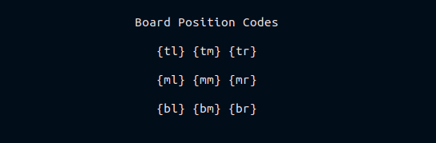

# go-tictactoe

A basic TicTacToe implementation in Golang

## Getting started;

### Enter Player Names

enter player names for both users

### Board Codes

These are the board position codes. `tl` represents top left position, `bm` bottom middle position, `mr` middle right, and so on. 

To start the game, simply ...

-   `make run`
